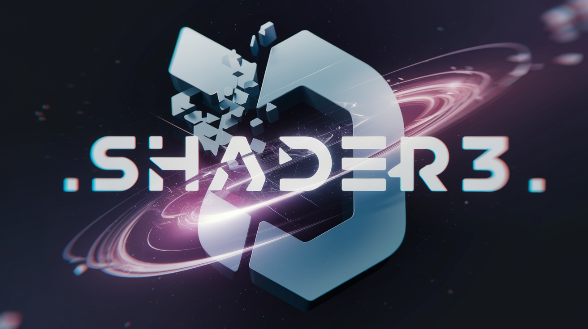
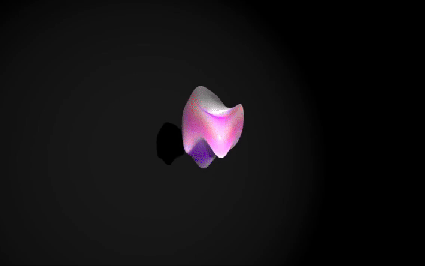

---

# Shader3 - Material Lab




`Shader3` is a library designed to provide new material extensions and customizations for built-in Three.js materials, offering additional flexibility and control over your 3D rendering. It also includes various noise functions for enhanced visual effects.

## Features

- **Custom Shader Materials:** Extend and customize Three.js materials such as `MeshPhysicalMaterial`, `MeshStandardMaterial`, and `MeshDepthMaterial`.
- **Shader Customization:** Easily integrate and modify vertex and fragment shaders.
- **Noise Functions:** Utilize a range of noise functions for creating unique visual effects.

## Installation

To install `Shader3` via npm:

```bash
npm install shader3
```

Or with yarn:

```bash
yarn add shader3
```

## Usage

### Importing

```typescript
import * as THREE from "three";
import {
  PhysicalShaderMaterial,
  StandardShaderMaterial,
  DepthShaderMaterial,
} from "shader3";
```

### Creating Custom Materials




```typescript
const material = new PhysicalShaderMaterial({
  vertexShader: `
    uniform float time; //uniform
    void main () {
      vec3 pos = s3_position; // s3_position provides you with xyz of model (vertex position)
      pos.y += sin((pos.y+time) * 1.0) * .1;
      s3_position = pos; // update s3_position to apply changes
`,
  fragmentShader: `
    uniform float time;
    void main () {
      gl_FragColor = vec4(mix(vec3(1.0,0.,0.), gl_FragColor.rgb, abs(sin(time))), 1.);
    }
 `,
  uniforms: {
    time: { value: 0.0 },
  },
});
```


## Updating Uniform

Updating uniform is easy as changing roughness of material:

`Material.uniform.value = value`

```typescript
const animate = () => {
  const elapsedTime = clock.getElapsedTime();

  uniforms.time.value = elapsedTime; //Updating Time

  renderer.render(scene, camera);
  requestAnimationFrame(animate);
};
```

## Noise Functions

The library includes various noise functions for advanced visual effects. Import and use them as follows:

```typescript
import { perlin } from "shader3";

// Import `perlin` in your shader code

const vertexShader = `
uniform float time;
${perlin} //here we add perlin noise function to our vertex
void main () {
  vec3 pos = s3_position;
  pos.y += perlin(pos+time);
  s3_position = pos;    
}`;
```

## API

### `PhysicalShaderMaterial`

- Extends `THREE.MeshPhysicalMaterial`.
- Supports custom vertex and fragment shaders.
- Accepts additional uniforms.

### `StandardShaderMaterial`

- Extends `THREE.MeshStandardMaterial`.
- Supports custom vertex and fragment shaders.
- Accepts additional uniforms.

### `DepthShaderMaterial`

- Extends `THREE.MeshDepthMaterial`.
- Supports custom vertex and fragment shaders.
- Accepts additional uniforms.

## Contributing

Contributions are welcome! Please open an issue or submit a pull request on the [GitHub repository](https://github.com/your-username/shader3).

## License

This project is licensed under the MIT License. See the [LICENSE](LICENSE) file for details.

## Acknowledgements

- Three.js: [https://threejs.org/](https://threejs.org/)
- GLSL: [https://en.wikipedia.org/wiki/OpenGL_Shading_Language](https://en.wikipedia.org/wiki/OpenGL_Shading_Language)

---
